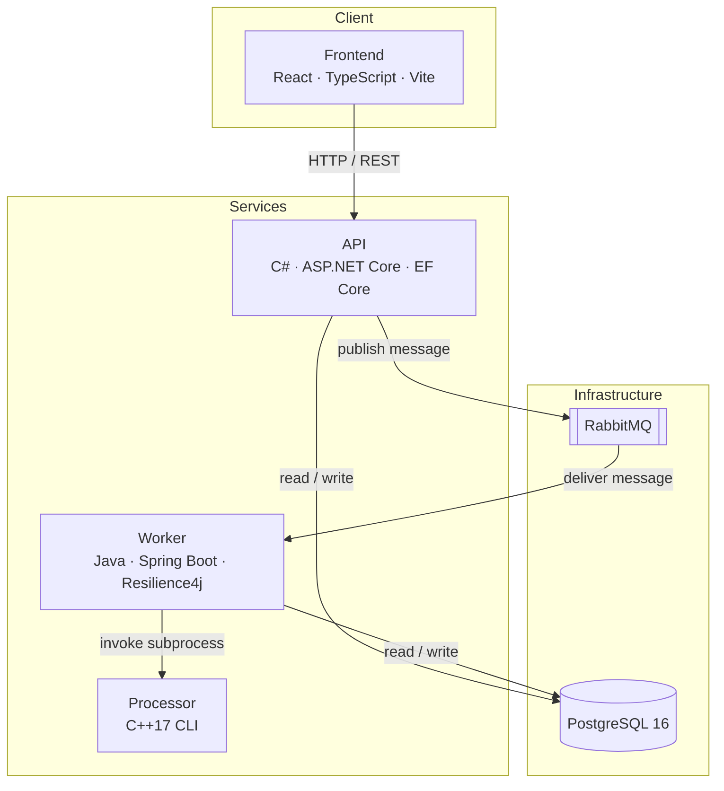

# FlowForge


[](https://github.com/mutabay/FlowForge/actions/workflows/ci.yml)

---

**A distributed workflow automation platform that orchestrates API calls, data transformations, and processing pipelines through an event-driven microservice architecture.**

Users design workflows visually, trigger execution with a click, and monitor results in real time — while behind the scenes, four services coordinate through message queues to process each step with built-in fault tolerance.

---

## Demo

> 📸 *Screenshots and demo GIF will be added here.*
>
> To add: capture the workflow editor canvas, an execution in progress, and the log viewer.

---

## Features

- **Visual workflow designer** — Drag-and-drop canvas for building step graphs (React Flow)
- **Asynchronous execution** — Non-blocking: API returns `202 Accepted`, worker processes in background
- **DAG-based step ordering** — Topological sort determines execution sequence; cyclic graphs are rejected
- **Automatic retry** — Resilience4j retries transient failures (3 attempts, 1s backoff)
- **Per-step failure isolation** — Step N failure preserves results from steps 1 through N-1
- **Structured execution logs** — Timestamped, level-tagged entries (debug/info/warn/error) per step
- **Input validation** — FluentValidation at the API boundary rejects malformed requests early
- **High-performance CSV processing** — Dedicated C++ binary handles batch transformations without GC overhead
- **Live status updates** — Frontend polls execution state with configurable intervals
- **Single-command deployment** — Docker Compose starts all services, databases, and queues

---

## Tech Stack

| Layer | Technology | Role |
|-------|-----------|------|
| **Frontend** | React 19, TypeScript, Vite, TailwindCSS, React Flow | Workflow designer and monitoring dashboard |
| **API** | C# / .NET 10, ASP.NET Core, EF Core, FluentValidation | REST endpoints, validation, message publishing |
| **Worker** | Java 21, Spring Boot 3.2, Spring AMQP, Resilience4j | Message consumption, step execution, retry logic |
| **Processor** | C++17, CMake, nlohmann/json | CSV → JSON transformation CLI |
| **Database** | PostgreSQL 16 | Workflow definitions, execution state, logs (JSONB for configs) |
| **Message Broker** | RabbitMQ 3.13 | Durable async communication between API and Worker |
| **CI/CD** | GitHub Actions | Four parallel build/test jobs on every push |
| **Infrastructure** | Docker Compose | Orchestrated local and dev deployment |

---

## Architecture Overview



**Design decisions:**

| Challenge | Solution |
|-----------|----------|
| API must not block on long-running workflows | Message queue decouples request acceptance from processing |
| Steps have execution dependencies | Topological sort on DAG edges determines order |
| External HTTP calls can fail transiently | Resilience4j retry with configurable attempts and backoff |
| Invalid input must not reach the database | FluentValidation at controller boundary — fail fast |
| CSV parsing must handle large files efficiently | Dedicated C++ subprocess — no JVM memory/GC constraints |
| Frontend needs status without WebSocket complexity | TanStack Query polling with adaptive intervals |

---

## Getting Started

### Prerequisites

- [Docker Desktop](https://www.docker.com/products/docker-desktop/) (includes Docker Compose)

That's it for running the full platform. For local development of individual services:

| Service | Requires |
|---------|----------|
| API | .NET 10 SDK |
| Worker | Java 21 + Maven |
| Frontend | Node.js 22+ |
| Processor | CMake 3.16+ and a C++17 compiler |

### Installation

```bash
git clone https://github.com/mutabay/FlowForge.git
cd FlowForge
```

### Running the Project

```bash
cd infra
docker-compose -f docker-compose.yml -f docker-compose.dev.yml up -d
```

All services start automatically with health checks and dependency ordering:

| Service | URL |
|---------|-----|
| **Frontend** | http://localhost:5173 |
| **API / Swagger** | http://localhost:5000/swagger |
| **RabbitMQ Management** | http://localhost:15672 |
| **PostgreSQL** | `localhost:5432` |

> Credentials: `flowforge` / `flowforge_dev` for all services.

To stop:

```bash
docker-compose -f docker-compose.yml -f docker-compose.dev.yml down
```

---

## Usage Examples

### Create a Workflow

```bash
curl -X POST http://localhost:5000/api/workflows \
  -H "Content-Type: application/json" \
  -d '{
    "name": "Fetch and Transform",
    "steps": [
      { "tempId": "s1", "name": "Get Data", "type": "http_request",
        "config": { "url": "https://jsonplaceholder.typicode.com/todos/1", "method": "GET" },
        "positionX": 100, "positionY": 100 },
      { "tempId": "s2", "name": "Extract Title", "type": "transform_json",
        "config": { "expression": "$.title" },
        "positionX": 350, "positionY": 100 }
    ],
    "edges": [ { "sourceTempId": "s1", "targetTempId": "s2" } ]
  }'
```

### Run the Workflow

```bash
curl -X POST http://localhost:5000/api/workflows/{id}/run
# Returns 202 Accepted — execution starts asynchronously
```

### Check Execution Status

```bash
curl http://localhost:5000/api/executions/{execution_id}
# Returns status, step results, and logs
```

---

## API Reference

| Method | Endpoint | Description |
|--------|----------|-------------|
| `GET` | `/api/health` | Health check |
| `GET` | `/api/workflows` | List all workflows |
| `POST` | `/api/workflows` | Create a workflow |
| `GET` | `/api/workflows/{id}` | Get workflow by ID |
| `PUT` | `/api/workflows/{id}` | Update a workflow |
| `DELETE` | `/api/workflows/{id}` | Delete a workflow |
| `POST` | `/api/workflows/{id}/run` | Trigger execution |
| `GET` | `/api/workflows/{id}/executions` | Execution history for a workflow |
| `GET` | `/api/executions` | List all executions |
| `GET` | `/api/executions/{id}` | Execution details with step results and logs |

Full Swagger documentation available at `/swagger` when the API is running.

---

## What I Learned / Challenges Solved

### Message Contract Design
Defining a clean boundary between the C# API and Java Worker required a shared message format. The contract is minimal (`executionId`, `workflowId`, `timestamp`) — the worker loads full workflow data from the database rather than passing large payloads through the queue. This keeps messages small and avoids versioning issues.

### Topological Sort for Step Ordering
Workflows are directed acyclic graphs. The worker performs Kahn's algorithm (BFS-based topological sort) to determine execution order. If the sort produces fewer nodes than the input, the graph contains a cycle — the execution is rejected immediately with a clear error.

### Cross-Language Subprocess Communication
The Java worker invokes the C++ processor as a subprocess, passing file paths as arguments. Error handling relies on exit codes (0 = success, non-zero = failure) and stderr capture. Temporary files are created and cleaned up in a `finally` block to prevent disk leaks.

### Retry vs. Fail-Fast Distinction
Not all errors deserve retry. `IllegalArgumentException` (wrong step type) is a permanent error — retrying won't help. `IOException` or `HttpTimeoutException` are transient — retrying after a delay often succeeds. Resilience4j configuration explicitly separates these categories.

### Lock File Drift in CI
The frontend CI initially used `npm ci` which requires byte-perfect lock file synchronization. Cross-platform differences between local (Windows) and CI (Linux) npm versions caused persistent mismatches in optional native dependencies. Switching to `npm install` in CI resolved this without compromising reproducibility for the actual dependency tree.

---

## Project Structure

```
FlowForge/
├── apps/
│   ├── api/              # C# Web API
│   ├── worker/           # Java Worker
│   └── frontend/         # React UI
├── packages/
│   └── cpp-processor/    # C++ CLI
├── infra/
│   ├── docker-compose.yml
│   ├── docker-compose.dev.yml
│   └── init-db/001-schema.sql
└── .github/workflows/ci.yml
```

Each service has its own `README.md` with detailed setup, configuration, and architecture documentation.

---