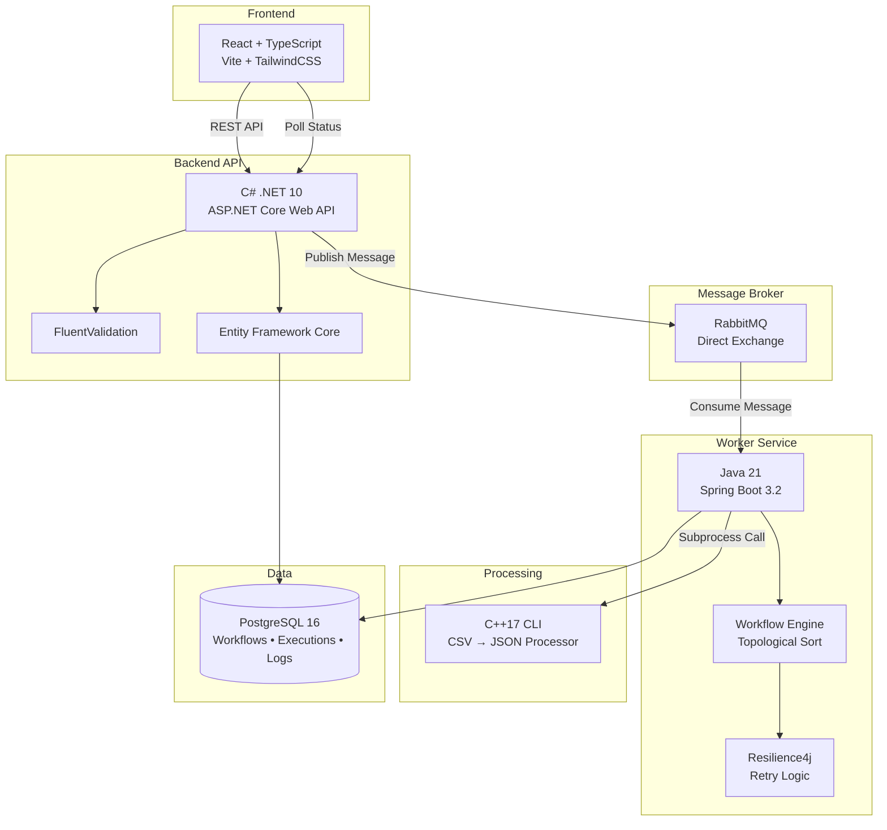
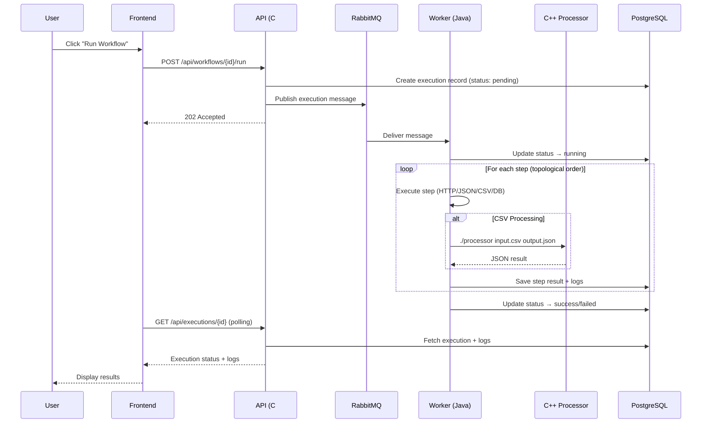
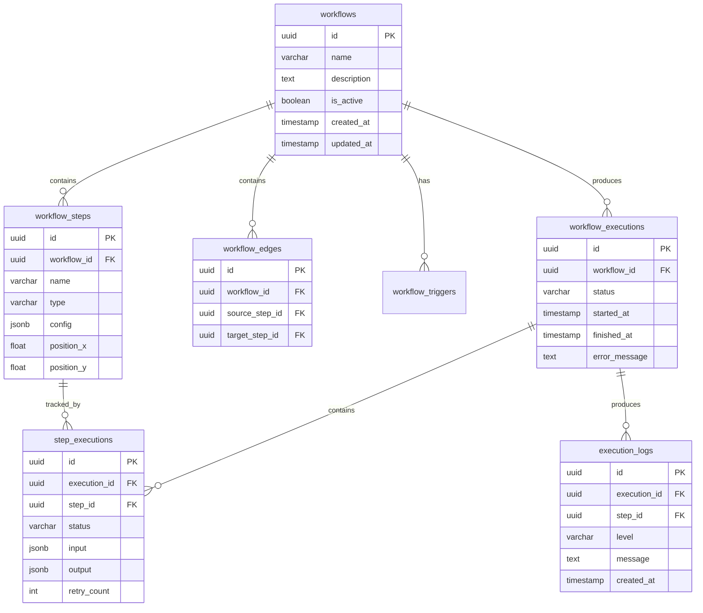
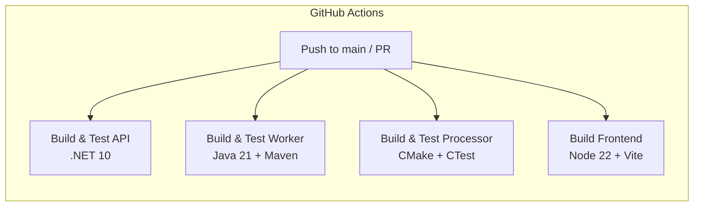

# FlowForge

**Distributed Workflow Automation Platform**

FlowForge is a production-grade workflow automation system that orchestrates API calls, database operations, and data transformations through event-driven pipelines. Built with a polyglot microservice architecture spanning C#, Java, TypeScript, and C++.

[](https://github.com/mutabay/FlowForge/actions/workflows/ci.yml)

---

## Architecture



---

## Execution Flow



---

## Tech Stack

| Layer | Technology | Purpose |
|-------|-----------|---------|
| **Frontend** | React 19, TypeScript, Vite, TailwindCSS, React Flow | Workflow designer & monitoring dashboard |
| **API** | C# / .NET 10, ASP.NET Core, EF Core, FluentValidation | REST API, orchestration, validation |
| **Worker** | Java 21, Spring Boot 3.2, Spring AMQP, Resilience4j | Async workflow execution with retry |
| **Processor** | C++17, nlohmann/json, CMake | High-performance CSV→JSON transformation |
| **Database** | PostgreSQL 16 | Workflows, executions, step results, logs |
| **Queue** | RabbitMQ 3.13 | Decoupled async communication |
| **CI/CD** | GitHub Actions | Automated build & test pipeline |
| **Infrastructure** | Docker Compose | Local development environment |

---

## Project Structure

```
FlowForge/
├── apps/
│   ├── api/                    # C# .NET Web API
│   │   └── FlowForge.Api/
│   ├── worker/                 # Java Spring Boot Worker
│   └── frontend/               # React + TypeScript UI
├── packages/
│   └── cpp-processor/          # C++17 CLI Tool
├── infra/
│   ├── docker-compose.yml      # PostgreSQL + RabbitMQ
│   ├── docker-compose.dev.yml  # Full stack (with API + Worker)
│   └── init-db/
│       └── 001-schema.sql      # Database schema
├── .github/
│   └── workflows/
│       └── ci.yml              # CI pipeline
└── IMPLEMENTATION.md           # Detailed implementation guide
```

---

## Quick Start

### Prerequisites

- Docker Desktop
- .NET 10 SDK
- Java 21 (Temurin)
- Maven 3.9+
- Node.js 22+
- CMake 3.16+
- C++ compiler (MSVC / GCC / Clang)

### 1. Start Infrastructure

```bash
cd infra
docker-compose up -d
```

This starts PostgreSQL (port 5432) and RabbitMQ (port 5672, management UI at http://localhost:15672).

### 2. Run the API

```bash
cd apps/api/FlowForge.Api
dotnet run
```

API available at http://localhost:5000. Swagger UI at http://localhost:5000/swagger.

### 3. Run the Worker

```bash
cd apps/worker
./mvnw spring-boot:run
```

Worker listens on RabbitMQ queue and executes workflows.

### 4. Run the Frontend

```bash
cd apps/frontend
npm install
npm run dev
```

UI available at http://localhost:5173.

### 5. Build the C++ Processor

```bash
cd packages/cpp-processor
mkdir build && cd build
cmake ..
cmake --build .
```

---

## API Endpoints

| Method | Endpoint | Description |
|--------|----------|-------------|
| `GET` | `/api/health` | Health check |
| `GET` | `/api/workflows` | List all workflows |
| `POST` | `/api/workflows` | Create a workflow |
| `GET` | `/api/workflows/{id}` | Get workflow details |
| `PUT` | `/api/workflows/{id}` | Update a workflow |
| `DELETE` | `/api/workflows/{id}` | Delete a workflow |
| `POST` | `/api/workflows/{id}/run` | Execute a workflow |
| `GET` | `/api/workflows/{id}/executions` | Get workflow executions |
| `GET` | `/api/executions` | List all executions |
| `GET` | `/api/executions/{id}` | Get execution details + logs |

---

## Workflow Step Types

| Type | Description | Configuration |
|------|-------------|---------------|
| `http_request` | Make HTTP calls to external APIs | `url`, `method`, `headers`, `body` |
| `transform_json` | Extract/transform JSON data | `expression` (JSONPath-like) |
| `csv_process` | Parse CSV → JSON via C++ engine | `input_file` or piped input |
| `db_query` | Execute database queries | *(planned)* |

---

## Data Model



---

## Message Contract

RabbitMQ message published when a workflow is triggered:

```json
{
  "executionId": "550e8400-e29b-41d4-a716-446655440000",
  "workflowId": "7c9e6679-7425-40de-944b-e07fc1f90ae7",
  "timestamp": "2026-07-01T12:00:00Z"
}
```

- **Exchange:** `flowforge.executions` (direct, durable)
- **Queue:** `flowforge.executions.queue` (durable)
- **Routing Key:** `execution.start`

---

## CI/CD Pipeline



All four jobs run in parallel on every push to `main` or pull request.

---

## Error Handling

| Layer | Strategy |
|-------|----------|
| **API** | FluentValidation (400), exception middleware (404/500) |
| **Worker** | Resilience4j retry (3 attempts, 1s delay), per-step failure isolation |
| **Processor** | Exit codes (0=success, 1=error), stderr for error details |
| **Frontend** | TanStack Query error states, automatic retry |

---

## Development

### Environment Variables

| Service | Variable | Default |
|---------|----------|---------|
| API | `ConnectionStrings__DefaultConnection` | `Host=localhost;...` |
| API | `RabbitMQ__Host` | `localhost` |
| Worker | `SPRING_DATASOURCE_URL` | `jdbc:postgresql://localhost:5432/flowforge` |
| Worker | `SPRING_RABBITMQ_HOST` | `localhost` |
| Frontend | `VITE_API_URL` | `http://localhost:5000/api` |

### Docker (Full Stack)

```bash
cd infra
docker-compose -f docker-compose.yml -f docker-compose.dev.yml up -d
```

---

## License

This project is for educational and portfolio purposes.
