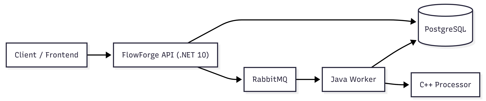
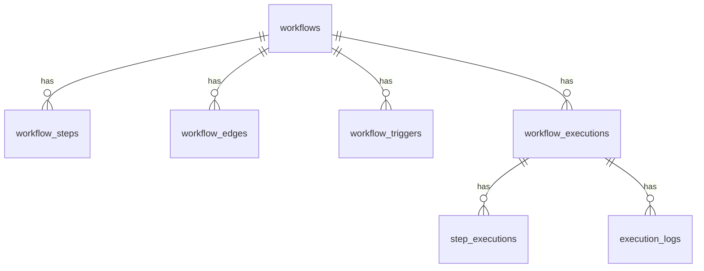

# FlowForge API

The backend API for FlowForge — a distributed workflow automation platform where users visually build workflows and run them.

This API is the **single entry point** between the frontend and the rest of the system. It stores workflows, triggers executions, and delegates processing to a background worker via RabbitMQ. It does not run workflows itself.



**Stack:** .NET 10 · ASP.NET Core · EF Core 10 · PostgreSQL 16 · RabbitMQ

---

## Endpoints

| Method | Route                            | Description                        |
|--------|----------------------------------|------------------------------------|
| GET    | `/api/health`                    | Health check                       |
| GET    | `/api/workflows`                 | List all workflows                 |
| GET    | `/api/workflows/{id}`            | Get workflow by ID                 |
| POST   | `/api/workflows`                 | Create workflow                    |
| PUT    | `/api/workflows/{id}`            | Update workflow                    |
| DELETE | `/api/workflows/{id}`            | Delete workflow                    |
| POST   | `/api/workflows/{id}/run`        | Trigger execution → `202 Accepted` |
| GET    | `/api/workflows/{id}/executions` | List executions for a workflow     |
| GET    | `/api/executions`                | List recent executions             |
| GET    | `/api/executions/{id}`           | Get execution + logs by ID         |

---

## Key Request / Response

### Create Workflow — `POST /api/workflows`

```json
{
  "name": "My Workflow",
  "steps": [
    { "tempId": "s1", "name": "Fetch Data", "type": "http_request", "config": { "url": "https://example.com" }, "positionX": 0, "positionY": 0 },
    { "tempId": "s2", "name": "Transform",  "type": "transform_json", "config": {}, "positionX": 200, "positionY": 0 }
  ],
  "edges": [
    { "sourceTempId": "s1", "targetTempId": "s2" }
  ],
  "trigger": { "type": "manual", "config": {} }
}
```

> `tempId` is a temporary client-side ID used to define edges before steps get database UUIDs.

Returns `201 Created` with the full workflow including real UUIDs.

### Run Workflow — `POST /api/workflows/{id}/run`

No request body needed. Returns `202 Accepted`:

```json
{ "id": "uuid", "workflowId": "uuid", "status": "pending", "createdAt": "..." }
```

The actual execution is processed asynchronously by the worker.

---

## Data Model



---

## Running Locally

**1. Start infrastructure:**
```bash
cd infra && podman-compose up -d
```

**2. Run the API:**
```bash
cd apps/api/FlowForge.Api
dotnet run
```

API: `http://localhost:5000`
OpenAPI schema: `http://localhost:5000/openapi/v1.json`

---

## Testing

Use any HTTP client (curl, Postman, VS Code REST Client).

**1. Health check**
```http
GET http://localhost:5000/api/health
```
Expected: `200 OK` → `{ "status": "healthy" }`

**2. Create a workflow**
```http
POST http://localhost:5000/api/workflows
Content-Type: application/json

{
  "name": "Test Workflow",
  "steps": [
    { "tempId": "s1", "name": "Step One", "type": "http_request", "config": {}, "positionX": 0, "positionY": 0 }
  ],
  "edges": [],
  "trigger": { "type": "manual", "config": {} }
}
```
Expected: `201 Created` with workflow ID in response.

**3. List workflows**
```http
GET http://localhost:5000/api/workflows
```
Expected: `200 OK` with array containing your workflow.

**4. Run the workflow** (copy the `id` from step 2)
```http
POST http://localhost:5000/api/workflows/{id}/run
```
Expected: `202 Accepted` with `status: "pending"`.

**5. Check execution status** (copy the execution `id` from step 4)
```http
GET http://localhost:5000/api/executions/{executionId}
```
Expected: `200 OK` with execution details.

---

## Error Responses

```json
{ "error": "Workflow {id} not found" }
```

| Status | Cause                  |
|--------|------------------------|
| 400    | Validation failed       |
| 404    | Resource not found      |
| 500    | Unexpected server error |
