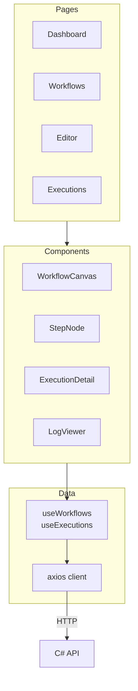

# FlowForge Frontend


**The workflow designer and execution monitoring dashboard. Users build workflows visually on a canvas, trigger runs, and observe step-by-step results in real time.**

---

## What It Does

- Provides a drag-and-drop canvas for composing workflow steps (React Flow)
- Sends workflow definitions and run commands to the C# API
- Polls execution state via TanStack Query and displays live progress
- Shows structured logs with color-coded severity levels

---

## Pages

| Route | Component | Purpose |
|-------|-----------|---------|
| `/` | DashboardPage | Overview stats and quick actions |
| `/workflows` | WorkflowsPage | List all workflows with run/edit/delete |
| `/workflows/new` | WorkflowEditorPage | Create a new workflow on the canvas |
| `/workflows/:id` | WorkflowDetailPage | View workflow definition + trigger run |
| `/workflows/:id/edit` | WorkflowEditorPage | Edit existing workflow |
| `/executions` | ExecutionsPage | View execution list + detail with logs |

---

## Architecture



---

## Key Dependencies

| Package | Purpose |
|---------|---------|
| `@tanstack/react-query` | Server state, caching, polling |
| `react-router-dom` | Client-side routing |
| `reactflow` | Workflow graph canvas |
| `axios` | HTTP client |
| `tailwindcss` | Utility-first styling |

---

## Running Locally

```bash
cd apps/frontend
npm install
npm run dev
```

Available at http://localhost:5173. The Vite dev server proxies `/api` to `http://localhost:5000`.

---

## Scripts

| Command | What it does |
|---------|-------------|
| `npm run dev` | Start dev server with HMR |
| `npm run build` | TypeScript check + Vite production build |
| `npm run lint` | Run oxlint |
| `npm run preview` | Serve production build locally |

---

## Configuration

| Variable | Default | Purpose |
|----------|---------|---------|
| `VITE_API_URL` | `http://localhost:5000/api` | Backend API base URL |

The Vite proxy in `vite.config.ts` forwards `/api` requests to the backend during development.

---

## Project Structure

```
src/
├── api/
│   ├── client.ts          # Axios instance
│   ├── workflows.ts       # Workflow CRUD + run
│   └── executions.ts      # Execution queries
├── components/
│   ├── Layout.tsx          # Shell with sidebar navigation
│   ├── WorkflowCanvas.tsx  # React Flow wrapper
│   ├── StepNode.tsx        # Custom graph node
│   ├── WorkflowList.tsx    # Table with actions
│   ├── ExecutionDetail.tsx # Status + step results
│   └── LogViewer.tsx       # Terminal-style log display
├── pages/                  # Route-level components
├── hooks/                  # TanStack Query hooks with polling
├── types/index.ts          # Shared TypeScript interfaces
├── App.tsx                 # Router + QueryClient setup
└── main.tsx                # Entry point
```

---

## Building for Production

```bash
npm run build
```

Output: `dist/` — static files ready to serve via nginx or any CDN.
