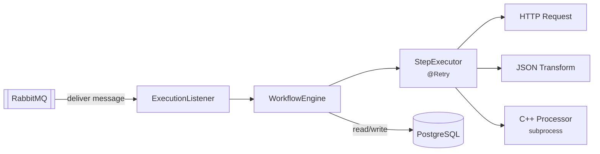

# FlowForge Worker


**The asynchronous execution engine that consumes workflow messages from RabbitMQ, orchestrates step execution in topological order, and persists results with full observability.**

---

## Responsibility

The Worker does not expose any public API. It operates entirely through message consumption:

1. Receives an execution message from RabbitMQ
2. Loads the workflow definition from PostgreSQL
3. Determines step execution order via topological sort (Kahn's algorithm)
4. Executes each step sequentially, passing output forward
5. Retries transient failures automatically
6. Records per-step results and structured logs

---

## Architecture



---

## Step Types

| Type | Behavior | Input |
|------|----------|-------|
| `http_request` | Calls external HTTP API, captures response body | Config: `url`, `method`, `headers`, `body` |
| `transform_json` | Extracts fields from JSON using path expressions | Config: `expression` (e.g., `$.data.items`) |
| `csv_process` | Invokes C++ processor as subprocess | Previous step output or `input_file` config |
| `db_query` | *(planned)* | — |

---

## Retry Policy

Powered by Resilience4j `@Retry`:

| Setting | Value |
|---------|-------|
| Max attempts | 3 (1 original + 2 retries) |
| Wait between attempts | 1 second |
| Retried | `IOException`, `HttpTimeoutException`, `RuntimeException` |
| Not retried | `IllegalArgumentException`, `UnsupportedOperationException` |

If all attempts fail, the step is marked `failed` and the execution stops. Previous step results are preserved.

---

## Configuration

All settings in `src/main/resources/application.properties`:

| Property | Default | Purpose |
|----------|---------|---------|
| `spring.datasource.url` | `jdbc:postgresql://localhost:5432/flowforge` | Database connection |
| `spring.datasource.username` | `flowforge` | DB user |
| `spring.datasource.password` | `flowforge_dev` | DB password |
| `spring.rabbitmq.host` | `localhost` | RabbitMQ host |
| `spring.rabbitmq.port` | `5672` | RabbitMQ port |
| `flowforge.processor.path` | `/opt/flowforge/processor` | Path to C++ binary |

---

## Running Locally

Requires PostgreSQL and RabbitMQ (start via `infra/docker-compose.yml`).

```bash
cd apps/worker
./mvnw spring-boot:run
```

The worker connects to RabbitMQ and begins consuming messages immediately.

---

## Building

```bash
./mvnw clean package -DskipTests    # JAR output in target/
docker build -t flowforge-worker .   # Docker image
```

---

## Message Contract

Consumed from queue `flowforge.executions.queue`:

```json
{
  "executionId": "550e8400-e29b-41d4-a716-446655440000",
  "workflowId": "7c9e6679-7425-40de-944b-e07fc1f90ae7",
  "timestamp": "2026-07-01T12:00:00Z"
}
```

Exchange: `flowforge.executions` (direct, durable)
Routing key: `execution.start`

---

## Project Structure

```
src/main/java/com/flowforge/worker/
├── WorkerApplication.java       # Entry point
├── config/RabbitConfig.java     # Exchange, queue, binding declarations
├── listener/ExecutionListener.java
├── engine/
│   ├── WorkflowEngine.java     # Orchestration + topological sort
│   └── StepExecutor.java       # Step dispatch + @Retry
├── model/                       # JPA entities (WorkflowData, StepData, EdgeData)
├── repository/                  # Spring Data repositories + native queries
└── service/LogService.java      # Execution log writer
```
